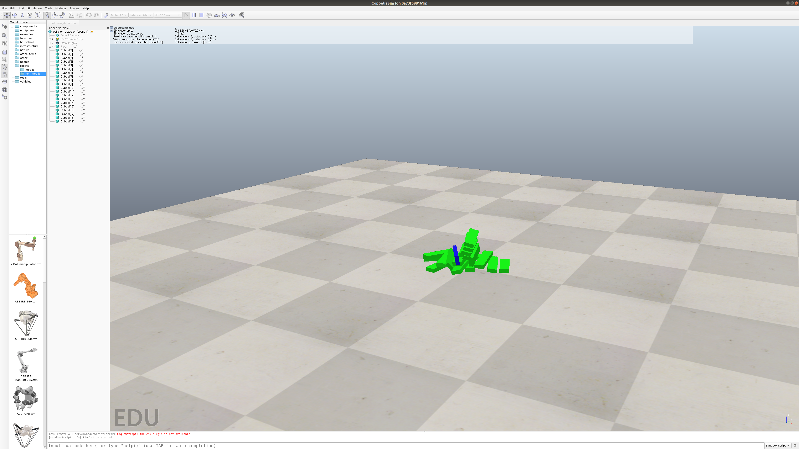
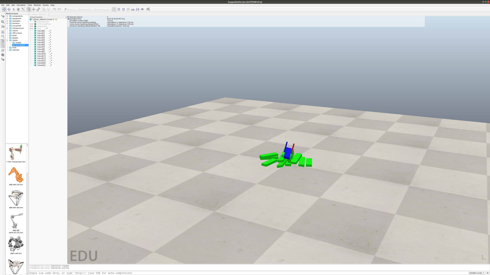

# Collision_Detection_Pyrep

0.Pyrep環境をインストール 

1.Collision_detection.pyを起動

2.Cuboidの山が問題なく積み上がっていた場合、terminalで'yes'を入力

3.その後は円柱がキューブの側面を移動、このとき他のオブジェクトに触れると円柱が赤くなり、terminalに把持したポイントが表示（この表示は未完成）

